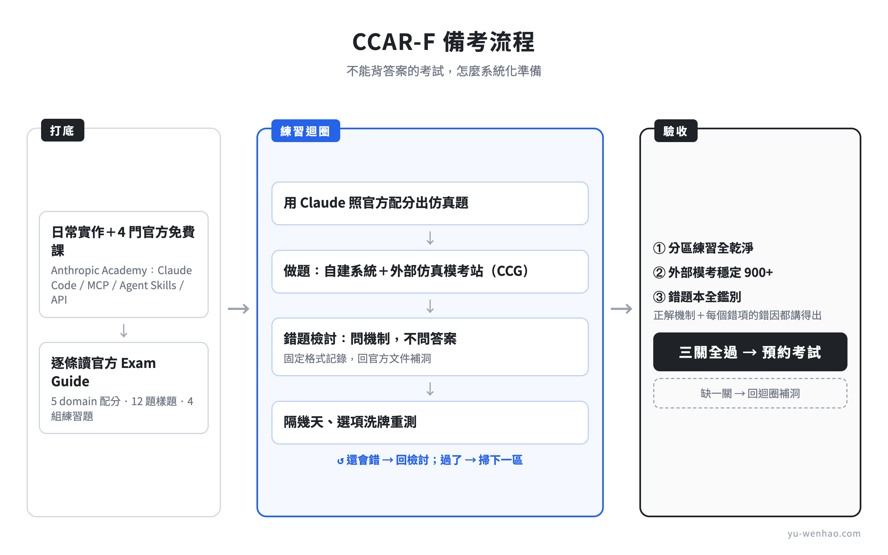

> **[v4 修訂紀錄 — 非文章正文，發布前刪除本區塊]**
>
> v4＝SEO 與讀者價值優化輪（v3 定版後，使用者核准整包執行）：
> 1. 關鍵字補洞：命名句加「媒體多稱 CCA-F 或 CCAF」（別名流量，v3 全文零出現）；H2-2 首句加中文名「Claude 認證架構師」（月搜 92）
> 2. H2 改造 ×4（CCAR-F 進標題）；FAQ 6 題改走 frontmatter faq: 結構（站上慣例，見 frontmatter-notes.md），正文不設 FAQ 節
> 3. Bug 修正：方法節路線圖「怎麼判讀數據」→「什麼時候該去預約」；「考的是判斷」三連砍一；「細節版本」→「完整規則」
> 4. Preparation Exercises 改中性陳述（作者無使用記憶，撤回「值得先讀」背書）——使用者未答 A/B，主 Claude 取安全預設 A，可改 B
> 5. 分工規則落地：制度數字單一產權歸母文；FAQ #5、#6 短答＋導流

---

# 2026 Anthropic 架構師證照 CCAR-F 考試心得：備考方法與考點解析

11 點 45 分，新竹光復路的帝國大樓三樓。我把印出來、寫滿決策樹的複習頁最後掃了一遍，跟手機、手錶、口袋裡所有東西一起鎖進置物櫃。兩小時後，螢幕跳出成績：882，及格線 720。

這場考的是 CCAR-F，Anthropic 的架構師認證。我從 2025 年 6 月開始用 Claude Code 開發產品，後來連生活和公司的日常運作也搬了上去；現在的工作環境以 Anthropic 生態系為主，也在企業內訓和公開班教 Claude Code 應用。所以這張證照 3 月一公開我就想考；真正埋頭準備的時間，前後一個多月。

決定要考之後我才發現，這張考試沒有「背題庫」這條捷徑：官方不公開任何考題，市面上的模擬題都是第三方自己出的，背得再熟，進考場遇到的還是沒見過的題目。認真準備完，我的結論反而是：就是因為沒有捷徑，這張證照才值得考。沒辦法背答案，只能把每個機制真的搞懂；一趟走完，我對 Claude 的架構和實務清楚了一大截，很多本來以為懂的東西，是在自己出題練習、檢討錯題的時候才真的懂。這篇把整套準備方法寫下來。

---

## CCAR-F 是什麼證照

CCAR-F 全名 Claude Certified Architect – Foundations，中文圈多稱「Claude 認證架構師」，是 Anthropic 官方認證體系裡給架構師角色的一張，考的是能不能判斷一套 AI 系統的架構該怎麼搭，不是考寫程式。

涵蓋範圍是四個核心技術：Claude Code、Claude Agent SDK、Claude API、MCP。官方給的理想考生畫像，是有半年以上實作經驗的 solution architect；考試本身是 60 題單選、120 分鐘，滿分 1000、及格 720，由 Pearson VUE 監考（就是辦 Cisco、微軟這類國際證照考試的那家監考機構）。考過拿到的是 Credly 數位徽章：國際證照通用的徽章平台，掛上 LinkedIn 或履歷，點開就能查驗真偽。名字裡的 Foundations 指的是架構師這條軌的入門級，不代表內容很基礎：題目走情境題路線，後面會給實例。

這張證照 2026 年 3 月首發時還沒有正式縮寫，媒體多稱 CCA-F 或 CCAF，7 月才定案正式考試代碼 CCAR-F；四張證照分別給誰考、怎麼報名、命名沿革怎麼變的，我在[另一篇文章](https://yu-wenhao.com/zh-TW/blog/anthropic-claude-certifications)整理過完整版，這裡直接跳過，把篇幅留給這場考試：考什麼、怎麼準備、考場長什麼樣。

---

## CCAR-F 考什麼：5 個 domain 的判斷題地圖

CCAR-F 官方 Exam Guide 把考試範圍切成 5 個 domain。單看名字容易以為是背規格，實際上每一區考的都是判斷。五區各舉一個它真正在問的問題：

**Agentic Architecture & Orchestration（27%）**：多個 agent 怎麼拆、怎麼協調。典型的判斷題長這樣：退款這種不能出錯的動作，該用 hook 在程式層硬擋，還是寫進 prompt 用引導的？這區的答案幾乎都指向同一個原則：要確定性，就不要靠 prompt。

**Tool Design & MCP Integration（18%）**：工具介面怎麼設計，agent 才會用對。agent 老是在兩個相似的工具之間選錯，該改工具描述，還是加一段 prompt 提醒它？這區的原則：描述是 agent 選工具的主要依據，描述不清，事後用 prompt 救不回來。

**Claude Code Configuration & Workflows（20%）**：規範跟工作流放進 Claude Code 的哪一層。同一條團隊規範，該寫進 CLAUDE.md、放路徑條件的 rules、包成 skill，還是用 hook 強制？這區的判斷軸：它該在什麼時候、對誰生效。

**Prompt Engineering & Structured Output（20%）**：怎麼讓輸出穩定可靠。輸出格式一直飄，該把格式說明寫得更細，還是換一種做法？這區的原則：格式要求寫成文字說明，模型每次可能照不同的理解走；要鎖死格式，用 tool_use 加 JSON schema 強制；要輸出一致，直接給 few-shot 範例讓它照著做。

**Context Management & Reliability（15%）**：長對話怎麼不退化、什麼時候該讓真人接手。客戶開口說要找真人，agent 該先試著自己解，還是立刻轉接？這區的原則：升級看明確訊號（客戶明說、政策有缺口），不看 agent 對複雜度的自我感覺。

這五區的題目，難的地方是同一個：症狀看起來很像，底下的機制不一樣。同樣是「規則沒被遵守」，要分是規則寫得模糊，還是規則明確但沒有強制手段；同樣是「agent 回答開始漏東西、變得不可靠」，要分是 context 快滿了、是中段內容被稀釋（塞得下，但抓不牢），還是讀進來的資料已經過期。症狀像，機制不一樣，答案完全不同。

所以複習的重點，是把每個機制的行為本身搞清楚；「什麼情況選什麼」用背的沒有用，題目的情境外衣一直換，底下的機制就那些。

---

## 我的備考方法：沒有考古題怎麼準備

方法拆開來看是五塊：知識從哪裡來、怎麼自己出題、怎麼檢討錯題、什麼時候該去預約，以及題目實際長什麼樣。

### 知識從哪裡來

我的底子是日常實作。前面說過，我的工作環境本來就以 Anthropic 生態系為主。但實作經驗有個特性：用得深的地方很深，沒碰到的地方就是空白。拿我自己來說，Claude Code 跟 MCP 每天都在用，Agent SDK 就碰得少。

系統性的補課，我用 [Anthropic Academy](https://anthropic.skilljar.com/) 的免費線上課，考前上完四門：Claude Code in Action、Introduction to Model Context Protocol、Introduction to Agent Skills、Claude with the Anthropic API。這四門把 Exam Guide 的知識面大致鋪滿。

剩下的洞，是靠檢討錯題時回官方文件一條一條補起來的，這件事後面講檢討方法時會展開。

### 沒有考古題，就自己出題

CCAR-F 沒有考古題：考試合約明寫禁止散布、複製、公開任何考題內容，連考生憑記憶重建都不行。官方給的準備素材就一份 Exam Guide，在 [CCAR-F 認證頁](https://anthropic-partners.skilljar.com/claude-certified-architect-foundations-certification)就能下載，不用註冊也不用先報名：裡面列了 domain 配分、每條 objective 的描述、12 題附解析的公開樣題，還有 4 組動手做的 Preparation Exercises，各自標明對應的 domain。

坊間有第三方模考網站（我自己也用了一個來測程度，後面會講），但這張考試 2026 年 3 月才首發，第三方題庫的覆蓋面跟出題邏輯貼不貼官方權重，很難驗證。要照官方權重補自己的洞，最直接的做法是自己出題。

我的做法是把 Exam Guide 逐條讀完，用 Claude 依官方樣題的出題邏輯生仿真題，做完逐題檢討，整理成一個自用的練習系統：分區的觀念快檢，加一份 60 題全真模考。模考的題數跟計時比照官方明訂的 60 題、120 分鐘，配題也照官方權重，單螢幕、不查資料，盡量貼近應考條件。

這條路不需要會寫網站也能複製：把 Exam Guide 餵給 Claude，請它照配分出仿真題，一樣練得到。在 NDA 禁止重建真題的前提下，自己出題是最乾淨的練法。

出題加檢討這一圈跑下來，最大的作用是把「我以為官方說了什麼」跟「官方實際說了什麼」的落差，一條一條逼出來。

### 錯題怎麼檢討

不管題目來自自建站還是外面的模考站，檢討的做法都一樣，四個動作。

每一題錯的，進一個固定格式：這題考哪個機制、我選了什麼、當時為什麼那樣選、正解的機制是什麼、我的理解斷在哪裡。重點是「當時為什麼那樣選」：不寫下來，同一個直覺下次還是會冒出來。

檢討時我把錯題丟給 Claude，但問法有講究：不是問「答案是什麼」，是問「這題在測什麼機制、我的理解哪裡斷了」。答案背起來只能應付同一題，機制搞懂了才遷移得到下一題。斷點常常要回官方文件才補得起來，知識補洞真正發生的地方就在這裡。

驗收留存用時間差。同一天檢討完馬上重測，幾乎都會過，那是短期記憶，不算數；隔幾天、選項重新洗牌再測，還對，才是真的留下來；隔兩三個星期還對，就可以放心。

目標不是把錯題清零，是同一型的錯不再犯。

### 檢討累積出來的刷選項法則

錯題檢討做多了，會開始看見題目的骨架。三條我覺得最值錢的法則，都是從官方樣題和模考錯題歸納的，不涉及任何真題。

**錯誤選項有四兄弟：加更多例子、把描述寫得更精確、換更強的模型、叫它自己檢查。** 這四種答案幾乎必錯。它們的共通點，是都想把 AI 那一步本身變得更可靠。但模型不管怎麼調，錯誤率就是降不到零，考題的情境通常還特別寫明「已經調過了，還是會出錯」。正解走的是另一條路：接受它會出錯，在它後面加一道攔截，像是輸出跑一組測試、過一個驗證器，或者把可疑的結果轉給真人看。錯誤還是會發生，但每一次都會被接住，不會靜靜流進下游。

**題幹寫「A team member proposes X」，X 幾乎必錯。** 提議如果就是正解，這題沒有出題價值。看到這個句型，先想 X 的問題在哪，通常那就是題目要的答案。

**題幹裡看似多餘的限定條件，是拿來殺選項的。** 像「context window 還沒滿」這句話，存在的唯一目的，就是殺掉所有衝著容量問題去的選項（壓縮、摘要那一類）。看到一句好像沒必要講的話，先找出它殺誰，答案常常就浮出來了。

### 怎麼知道自己準備好了

備考到某個程度，都會卡在同一個決定：什麼時候該去預約？我的判準是三關全過。

**第一關，自己的知識面和練習題全過。** 照官方權重做的分區練習掃過一輪，每一區都乾淨：錯的題當場搞懂，隔天重測過了才算補上，不是看過解答就翻頁。

**第二關，外部題庫穩定 900 以上。** 自己出的題再怎麼公正，都可能不自覺避開自己的盲點，所以要拿沒看過的題目驗。我在 [Claude Certification Guide](https://claudecertificationguide.com/)（CCG）這個模考站前後考了五場全真模考，每場考完就逐題檢討錯題、隔幾天重測；分數從 766、846、901，一路到考前兩場的 903 跟 915。真正上場，考出來是 882。模考跟實考的落點對得上，這是我敢點名推薦它的主要原因。CCG 是我自己找的，跟我沒有合作關係；CCAR-F 的題庫目前免費、題目量夠、有分 domain 的成績報告，錯題拿回來檢討的價值也很高。

不過別指望單靠刷題過關：刷到後來很容易變成死記硬背，選項換個包裝就破功。題庫的角色是驗證和補洞；底子還是要靠實作經驗和把機制搞懂，學起來才紮實。

**第三關，錯題本全部鑑別得出來。** 收錄過的每一題錯題，選得對之外，還要能講出正解的機制，和每個錯誤選項錯在哪。驗收方式就是檢討那節的時間差重測：考前把整本錯題閉卷測一輪，選項重新洗牌；自測時猜對不算對，答不出來就老實記一筆，回去補完再測。

三關都過了，再去約考場；少一關，先回去補洞，不要拿正式考試當模考。

### 兩題示範：考題長什麼樣

兩題都保留英文原樣：正式考試就是英文，沒有中文版，先習慣這個密度。

第一題直接引官方 Exam Guide 公開的 12 題樣題之一（Question 6，原文照錄）：

> Your codebase has distinct areas with different coding conventions: React components use functional style with hooks, API handlers use async/await with specific error handling, and database models follow a repository pattern. Test files are spread throughout the codebase alongside the code they test (e.g., Button.test.tsx next to Button.tsx), and you want all tests to follow the same conventions regardless of location. What's the most maintainable way to ensure Claude automatically applies the correct conventions when generating code?
>
> A) Create rule files in .claude/rules/ with YAML frontmatter specifying glob patterns to conditionally apply conventions based on file paths
> B) Consolidate all conventions in the root CLAUDE.md file under headers for each area, relying on Claude to infer which section applies
> C) Create skills in .claude/skills/ for each code type that include the relevant conventions in their SKILL.md files
> D) Place a separate CLAUDE.md file in each subdirectory containing that area's specific conventions

正解是 A。這題穿的情境外衣是「測試檔案該放哪」，底下考的是一條規則什麼時候該用路徑條件自動套用、什麼時候該放進永遠載入的設定檔。

B 靠模型自己猜不保證，C 要手動叫跟「自動套用」的要求矛盾，D 用資料夾綁規則，處理不了散落在多個目錄的檔案。

第二題來自 [CCG](https://claudecertificationguide.com/) 的題庫（原題照錄），就是我兩次作答都選錯的那一題：

> A Claude Code agent has been working on a feature branch for 45 minutes and has accumulated extensive context about the codebase. The developer notices that several tool results from early in the session (file reads from 40 minutes ago) are now stale because a colleague pushed changes to those files. The agent is making recommendations based on the outdated file contents. What is the best recovery strategy?
>
> A) Continue in the current session and simply ask the agent to re-read the files a colleague changed, so it picks up the latest contents
> B) Start a completely new session with no context from the previous session
> C) Start a fresh session with a summary of the key findings and decisions, then read the changed files for current state
> D) Use fork_session to create a new branch that excludes the stale tool results

正解是 C。我兩次都選了 A，而且兩次都是同一種直覺：叫它重讀檔案，agent 應該就跟著更新了。

A 沒有壞到不能用：實務上小場面這樣做常常也過得去，重讀之後補一句「以新版為準」，多數時候 agent 就跟上了。它的問題在機制：context 只能加，不能改也不能刪，重新讀取是把新版內容疊上去，舊版檔案和建立在它上面的判斷都還留在對話裡，新舊兩份資料並存，agent 有機會在後面又引用到過期的那份。

B 把還有效的 45 分鐘架構理解整個丟掉；D 的 fork_session 是從現在這個已經髒掉的狀態往外分岔，沒辦法只挑乾淨的部分留下。它是設計給「同一個起點，平行試兩種做法」的場景，不是拿來清過期資料的。

C 乾淨的地方在這裡：用摘要把還有價值的發現和決定帶過去，再讀最新的檔案，過期資料留在原地不帶走。

這題順便說明了一件事：考試要的是機制上最乾淨的答案，不是實務上混得過去的答案。實務裡 A 有時候撐得住，但 C 從頭到尾都是更穩的做法；考場上，只選 C。

---

## 考試當天：線上監考與實體考場

CCAR-F 可以選線上監考，也可以到實體考場應試，這是官方公告的兩種正式模式。

線上監考走的是 [Pearson VUE 的 OnVUE 系統](https://www.pearsonvue.com/us/en/anthropic/onvue.html)：考前要 check-in，過程包含拍一張本人的照片、拍證件照，還要用鏡頭 360 度掃過整個房間確認環境合格；桌面必須完全淨空，只能留應考用的電腦、核准的輔具，跟一杯沒有標籤的飲料。

全程只能用一個螢幕，其他螢幕要實體拔線，不是關機就好；耳機、虛擬機、VPN、公司網路都不能用。考試中要一個人獨自應考，不能離開鏡頭範圍，除非系統確認正在一段核准的休息時間內。

如果考試中遇到問題，唯一的求助管道是考試介面裡的文字聊天，監考人員不會幫忙暫停或延長時間，也不負責排查裝置或網路問題。

還有一個容易被忽略的細節：線上場次從招呼到監考全程只用英文溝通，過程中也不能開瀏覽器翻譯。完整規則可以在 [Anthropic Partner Academy 的認證 FAQ](https://anthropic-partners.skilljar.com/page/faq-certifications) 查到。

考題本身只有英文，這點線上和現場都一樣：選實體考場，拿到的也不會是中文卷。

我考的是現場，以下是現場這條路實際會遇到的流程。

證件要從報名那一步就處理對：報名填的是英文姓名，直接照護照上的拼音填，因為台灣的身分證、健保卡、駕照都只有中文，拿來對英文報名資料是對不上的。

報到當天，監考人員核對的就是護照：正本、未過期、政府核發、照片清楚可辨識，姓名跟報名資料完全一致。報名時照護照填了，這關就順。

第二證件也要準備：第一證件是護照，第二證件用身分證、健保卡或駕照都可以。

個人物品（手機、手錶、錢包、任何紙本筆記）全部要鎖進置物櫃，電子設備進去之前要先關機。遲到超過 15 分鐘，考場有權拒絕入場，而且不退費。

如果要在線上跟現場之間選，我會選現場。現場的好處是我只需要專注在答題上：安裝考試軟體、環境佈置、設備檢查、跟遠端監考人員的溝通，全都不用分心，那些是考場的事。

考場本身，我考的是精誠資訊（SYSTEX）在新竹的考場；恆逸教育訓練中心是精誠資訊旗下的教育訓練事業，也是 Pearson VUE 授權的考場單位之一。台灣的實體考場分布不少：台北、桃園、新竹、台中、台南、高雄，連花蓮都有。實際據點跟可預約時段，報名時在 [Pearson VUE 的 Anthropic 專頁](https://www.pearsonvue.com/us/en/anthropic.html)的考場查詢裡看最準；有想要的特定時段，要提早預約。

---

## 給備考者的建議

只給兩條。

**第一條，先實作，再考。** 這張證照適合已經在用的人收割，不適合想入門的人起步。官方的考生畫像寫得很清楚：半年以上實作經驗的 solution architect。還沒真的用過這些工具的話，先去用一段時間再回來：考題測的是實作裡才會長出來的判斷，直接衝考試，再認真也是在背別人的結論。

**第二條，英文閱讀是隱形的第二考科。** 60 題 120 分鐘，一題的時間額度是 2 分鐘，而每一題都是一大段英文情境。我剛開始練的時候，光把一題讀懂就要花 4 到 5 分鐘，照那個速度，寫到 30 幾題時間就會用完。這個速度練得起來：實際上考場那天，60 題寫完還剩 15 分鐘可以回頭檢查。所以準備時就要用英文練，別用中文資料讀到最後一刻，進考場才第一次用英文面對完整情境。

兩條之外，還有一個報名的硬門檻：這張考試目前只開放 Claude Partner Network 組織的成員報名，用個人 email 是報不了的；現階段想考，只能透過已經在網絡裡的組織。

如果前面兩條你都不缺（實作有底子、英文題也不排斥），只是卡在報名資格，可以找我：我的組織就在網絡裡，怎麼透過組織參加考試，都可以問。[留個聯絡方式](https://ccarf-contact.pages.dev/)，我會親自回信。

---

## 考完之後

從 3 月看到這張證照發布就想考，8 月底終於考完，badge 掛上了 Credly。考完之後，最有感的差別在日常工作裡。每一個架構決定背後，我都更清楚為什麼：什麼時候該把規範寫進 CLAUDE.md、什麼時候得用 hook 強制；什麼事丟給 subagent 隔離著做、什麼事留在主對話；context 髒掉的時候，是繼續凹下去，還是開新對話、帶著摘要重來。

這些判斷以前靠手感，現在說得出機制。

*如果這篇讓你有了想法，[訂閱我的電子報](/zh-TW/)。我寫 AI 工作流，也寫一路上想通的事。*

---

**QUALITY SCORES**（flux-rubric v0.2.4-pre，editor 定稿終掃 from-scratch 重評）
- Personal Stake: 0.92 | Reframe: 0.90 | Concrete Evidence: 0.88 | Mental Model: 0.62 | Position: 0.91 | Voice: 0.78→0.90（Pattern N 兩處已換詞） | Scene Entry: 0.90 | Paragraph Rhythm: 0.80 | Verb Density: 0.85 | Funnel×CTA: 0.92 | System Fidelity: 0.80
**OVERALL: 0.86**（11.98÷14）｜Hard gate 9 條全過｜WEAKEST: Mental Model 0.62（刻意不造中心比喻，領土防撞，誠實評分）

**編輯終掃結論（2026-08-29）**：破折號正文 0、姿態句 0 復發、單場敘事紅線雙向掃 0 違規（「終於」等待弧放行、「兩次作答」指涉 CCG 放行）、Q–Y 第八層 Q/R/S/T/U/X 建議轉正、V 需補 regex 分支、Pattern N 2 筆已修。完整 Editor Report 與新版 ARTIFACTS JSON 見 pipeline 記錄；正文實測 9,731 字元（wc）、外鏈 10、圖 1、blockquote 2、「你」1（邀請）、破折號 0。

**發布前殘餘 blockers**：檔首修訂註記待刪／frontmatter＋H1 交 blog-metadata／發布日外部 re-check 清單（OnVUE 頁、精誠恆逸考場、CCG 免費現況、Academy 課程連結、考場城市清單）／【待使用者確認】4 筆見主對話。
